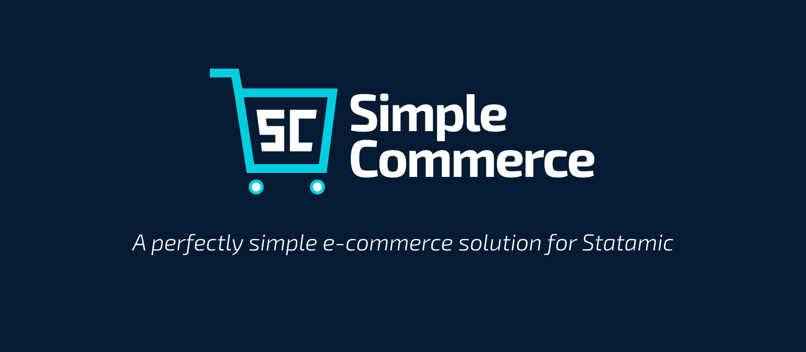

# Simple Commerce
> A perfectly simple e-commerce solution for Statamic

This repository contains the code for Simple Commerce. While the code is open-source, it's important to remember that you'll need to purchase a license before using this addon in production. Licenses cost $199 and can be purchased from the [Statamic Marketplace](https://statamic.com/addons/double-three-digital/simple-commerce).

[**→ Read Documentation**](https://sc-docs.doublethree.digital)

## Features

**Everything's just an entry.** Literally everything from your products to your orders and coupons are just entries sitting in collections.

**Full power of the front-end.** You're not glued to a set of predefined templates or a certain JavaScript framework, use whatever you need to make your site unique.

**Support for popular gateways.** Out of the box, Simple Commerce has support for some of the popular online payment gateways, including Stripe.

**Full control over the blueprints.** Apart from a title and a price, you can add whatever you'd like to your product blueprint. Same goes for other blueprints. We don't want to invade on your happy developer experience.

<!--
## Credits
* [Duncan McClean (Developer)](https://github.com/damcclean)
* [David A. Lindahl (Designer)](https://github.com/austriker27)
* [And other contributors](https://github.com/doublethreedigital/simple-commerce/graphs/contributors) -->

## Resources
* [Simple Commerce Documentation](https://sc-docs.doublethree.digital)
* [Simple Commerce Issues](https://github.com/doublethreedigital/simple-commerce/issues)
* [Simple Commerce Discord](https://discord.gg/P3ACYf9)

---

